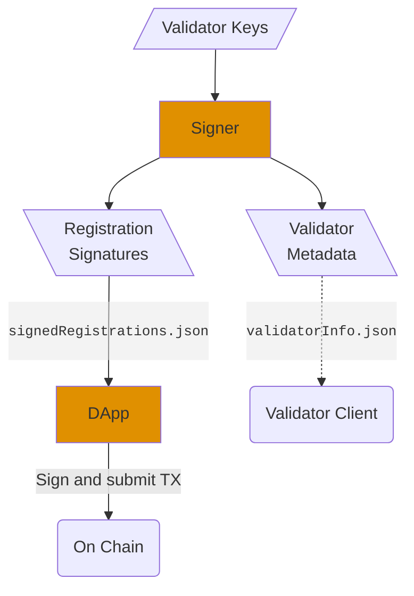

# **Shutter Validator Registration Workflow**

To enable Shutter on your Gnosis Chain validators follow this step-by-step guide. 
It will give you instructions for generating Shutter validator registration 
signatures using existing validator keystore files and submitting 
them to the Gnosis Chain.

---

## **Overview**

The registration consists of two components:
1. **Signature generator ("Signer")**:
   - Uses existing validator keystore files to generate signed validator registrations as well as a configuration file for your validator client.
2. **Signature submission DApp**:
   - Allows to submit the generated signatures on chain.



---

## **Requirements**

### System Requirements

- Docker and the docker compose plugin installed on your system.
- Access to:
  - Validator keystore files for your validator keys.
  - The password for the keystore files.

### **Configured `.env` File**
The `.env.example` file is provided as a template. Copy it to create your own `.env` file.

```bash
cp .env.example .env
```

#### **Provide your configuration**
Replace the placeholders (values in angle brackets) in the `.env` file with your actual values:

Example:
```plaintext
# Path to Keystore Files
KEYSTORE_DIR=/some/path/to/validator_keys

# Validator Keystore Password
KEYSTORE_PASSWORD=very-secure-password

# Validator start and end index (inclusive) 
# Registration signatures will be generated for these indices.
VALIDATOR_START_INDEX=4242
VALIDATOR_END_INDEX=4243
```

> [!IMPORTANT]
> There are two versions of the registration message format, version 0 and version 1.
> Version 1 allows multiple validators to be registered in a single transaction.
> 
> Version 1 is now fully enabled on Gnosis Chain and should be used for all registrations.
> It allows batched validator registration and replaces version 0.
> Version 0 is no longer supported.

---

## **Usage**

The workflow consists of two separate components that can either both be run on the same machine or each on different machines.
The easier option is to run both components on the same machine that also contains the validators keystores. 

### **Step 1: Build the docker images**
```bash
docker compose build
```

### **Step 2: Run the Signature Generator**

Run the Docker container to generate registration signatures:
```bash
docker compose up signer
```

---

#### **Outputs**

If the signature generation is successful, the following files will be created in the `registrations/` directory:

1. **`registrations/signedRegistrations.json`**:
   - Contains the signed messages required for registration on-chain.

2. **`registrations/validatorInfo.json`**:
   - Contains metadata necessary for running your validator client with Shutter enabled.

---

### **Step 3: Submit the signatures using the DApp** 

> [!NOTE]
> You can run the DApp either on the same system as you used to perform the previous steps or on a different one (for example your local machine).
> If you run it on a different machine, make sure to download the `signedRegistrations.json` file to that machine (e.g. via SSH or SFTP, etc.).

Run the DApp container:
```bash
docker compose up dapp
```
This will start a local web server running the DApp on port 3000.

---

#### **Using the DApp**

1. **Open the DApp in your web browser**
   - If you run the DApp on a remote server use `http://<server-ip>:3000`
   - If you run the DApp on your local machine use `http://localhost:3000`
2. **Connect Wallet**:
   - Connect your Web3 wallet (e.g., MetaMask).
   - Ensure the wallet has sufficient funds to cover gas fees.
3. **Upload `signedRegistrations.json`**:

   This step is slightly different depending on whether you run the DApp on the same machine you used to generate the signatures on or a different one:

   1. Same machine:
      - The DApp will detect the `signedRegistrations.json` file automatically and show a `Use Existing File` button.
        Click the button to load the file.
   2. Different machine:
      - Download the `signedRegistrations.json` file from the machine where you ran the signature generator (e.g. using SSH or SFTP, etc.)
      - Upload the file to the DApp using the `Choose File` button.
 
4. **Submit Signatures through transaction**:
   - Click the "Send Transaction" button to sign and send the registration data.
   - Wait for the transaction confirmation.

5. **View Transaction**:
   - The DApp will display the transaction hash.
   - You can click on the hash to show the transaction status on [GnosisScan](https://gnosisscan.io/).

---

## **Validator Node Setup**

Use the `validatorInfo.json` file generated by the signature generator to configure your validator node.

#### **Example Command for Nethermind**
```bash
nethermind --Shutter.Enabled=true --Shutter.ValidatorInfoFile=/path/to/output/validatorInfo.json
```

#### **Example Command for Erigon**
1. To verify validator registrations
```bash
erigon shutter-validator-reg-check --chain <CHAIN> --el-url <EL_RPC_URL> --validator-info-file <VALIDATOR_INFO_JSON>
```
2. To run Erigon
```bash
erigon --shutter [other options...]
```
More info at https://docs.erigon.tech
